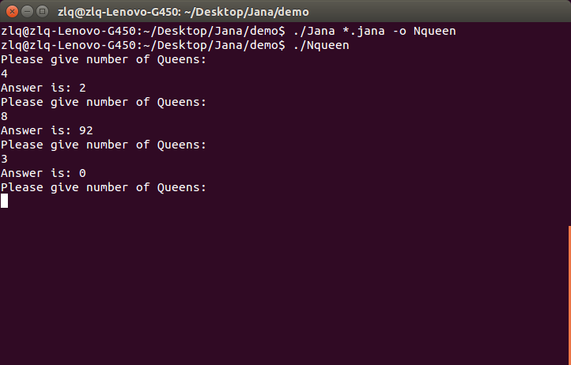

# 1.背景以及概述

- Jana是一种类似Java的面向对象语言，但是不是完全的面向对象，因为不支持继承和多态。

- 语言的文法定义简单而强大，而且基本上不用做文法变换就可直接进行递归下降分析。

- 整个编译器分为前端和后端，前端生成的是一种抽象机代码，后端生成的是AT&T格式的x86汇编。


# 2.源语言定义

```
class:      'class' className '{' classVarDec* 
            subrountineDec* '}'

classVarDec:
            ('static' | 'field') type varName* (',' 
            varName)* ';'

type:       'int' | 'char' | 'boolean' | className

subroutineDec:
            ('constructor' | 'function' | 'method')
            ('void' | 'type') subruntineName '(' 
            parameterList ')' subroutineBody

parameterList:
            ((type varName) (',' type varName))?

subrountineBody:
            '{' varDec* statements '}'

varDec:     'var' type varName (',' varName)* ';'

className:  identifier

varName:    identifier

subroutineName:
            identifier

statements: statment*

statment:   letStatement | ifStatement | whileStatement |
            doStatement  | returnStatement | forStatement

letStatement:
            letStatementwithoutSemicolon ';'
letStatementwithoutSemicolon:
            'let' varName ('[' expression ']')? '=' 
            expression 

doStatement:
            doStatementwithoutSemicolon ';'
doStatementwithoutSemicolon:
            'do' subrountineCall

letorDoStatementwithoutSemicolon:
            letStatementwithoutSemicolon | doStatementwithoutSemicolon      
            
ifStatement:
            'if' '(' expression ')' '{' statements '}'
            ('else' '{' statements '}')?

whileStatement:
            'while' '(' expression ')' '{' statements '}'

returnStatment:
            'return' expression? ';'

forStatement:
            'for' '(' letorDoStatementwithoutSemicolon ';'
            expression ';' letorDoStatementwithoutSemicolon ')' '{'
            statements '}'

expression: join ('||' join)*

join:       equality ('&&' equality)*
equality:   relation (('==' | '!=') relation)*
relation:   expr (('<=' | '>=' | '>' | '<') expr)*
expr:       term (('+' | '-') term)*
term:       modterm ('*' | '/' modterm)*
modterm:    bitwiseOr ('%' bitwiseOr)*
bitwiseOr:  Xorterm ('|' Xorterm)*
Xorterm:    bitwiseAnd ('^' bitwiseAnd)*
bitwiseAnd: prim_term ('&' prim_term) *

prim_term:  intConstant | strConstant | keywordConstant |
            varName | varName '[' expression ']' |
            subrountineCall | '(' expression ')' |
            unaryOp term


expressionList:
            (expression (',' expression)*)?

unaryOp:    '-' | '!'

subroutineCall:
            subrountineName '(' expressionList ')' |
            (className | varName) '.' subrountineName '('
            expressionList ')'


keywordConstant:
            'true' | 'false' | 'null' | 'this'

integerConstant:    numbers <- [-2147483648, 2147483637]

stringConstant:     '"' (unicode-character[1])* '"' 
            
identifier: number, character, '_', but not begin with num.

```

特别的有：

```
primitives: keyword | symbol(char) | integerConstant 
            stringConstant | identifier

keyword:   'class' | 'constructor' | 'function' | 
            'method' | 'field' | 'static' | 'var' |
            'int' | 'char' | 'boolean' | 'void' | 
            'true' | 'false' | 'null' | 'this' | 'let' |
            'do' | 'if' | 'else' | 'while' | 'return' | 'for'

symbol:     '{' | '}' | '(' | ')' | '[' | ']' | '.' | ','
            ';' | '+' | '-' | '*' | '/' | '%' | '&' | '|' |
            '!' | '^' | '<' | '>' | '=' | '==' | '<=' |
            '>=' | '!=' | '||' | '&&' 
```


# 3.Jana语言教程

- Jana改编自Java，因此大多数特征与Java类似，这里说明部分特色特征。

按照惯例```Helllo, World```程序作为开始。

```java
class Main {
    
    function void main() {
        var int a;
        do Output.printString("Hello, World\n");
        return;
    }
    
}
```

## 3.1数据类型

Jana提供三种内置的数据类型，int，boolean，char，当然也可以使用class定义其他数据类型，这里的数据类型仅仅是为了方便用户的使用，编译器并不支持数据类型的检查，需要用户保证类型的兼容型和正确性。

## 3.2 定义一个类(Class)

```java
class Student {

    static int counter;
    field int id;
    field Array score;

    constructor Student new(int studentid, Array array) {
        let counter = counter + 1;
        let id = studentid;
        let score = array;
        return this;
    }

    method void dispose() {
        do score.dispose();
        do Memory.deAlloc(this);
    }

    function int calculateSum(int a, int b) {
        return a + b;
    }

}
```

上述例子是一个简单的```Student```类的定义过程。

一个类的定义总是按照，变量定义，过程定义的顺序来进行结构化处理的。（详细信息参考文法）

### 3.2.1 类的数据成员

一个类里面的变量有两种类型，数目不限。

一种是static变量，static变量的含义同C++里面的static含义相同，这种类型的变量不属于某个类的实例，而是属于整个类，（整个程序运行过程中只在内存中创建一个空间），相反field类型的实例，在每个类创建一个实例的时候都要进行分配空间。


### 3.2.2 类的过程成员

一个类里面的过程最多有三种类型，数目不限。

- function类型

类似C++中的static类型的函数，这种过程的调用形式是```ClassName.functionName(...);```，调用这个过程与类的实例没有关系。比如上面的calculateSum，就是简单的计算两个数字的和，不需要指定某个Student的实例。

- method类型

属于类的实例中的方法，这种过程的调用形式是```instanceName.methodName(...);```，比如上面的```dispose```过程就是销毁这个类。

- constructor类型

属于某个类的构造函数，返回类型是当前类的类型。比如上述的```new```函数，返回了一个```Student```的实例。


## 3.3 定义一个过程(以```function```为例)

```java
functions int example(int a, Student b) {
    // 变量声明
    var int x1, x2, i;
    var Student s1;
    var Array a;
    // let 语句
    let x1 = a[x2];
    let i = 0;

    // do 语句
    do Output.printString("I love Cpp\n");
    
    // while 语句
    while (i < 10) {
        ...
    }
    // for 语句
    for (let i=0; i<10; let i=i+1) {
        ...
    }
    // if-else 语句
    if (x1 < 2) {
        ...
    } else {
        ...
    }
    // return 语句
    return 0;
}   

```


- 过程中的局部变量声明一定是以```var```开头，其他语句含义比较好理解，不详细展开说明。

- 为什么要区分let和do两种语句？

let和do两种语句本质上是没有任何区别的，但是这里我们认为做出如下规定，如果这个语句不含赋值信息，那么使用do作为开头的标志，如果出现了赋值信息，那么使用let作为开头的标志。（原因后文说明。）


- for 语句有什么特殊的规定？

```
for (let_or_do_statements; 某个测试表达式; let_or_do_statements) {
    statements;
}
```

## 3.4 常量

- 有32位int数字类型的常量。
- 字符串类型常量 "Hello world\n"(内部支持除了\"之外的转义字符)。
- 布尔常量 ```false, true```。
- 空值 ```null```。
- ```this```（非常量），指代当前的对象。

## 3.5 Jana 标准库

```java
---------------------------------------------------------------------
Array:          

function Array new(int size);   // 新建一个数组
method void dispose();          // 销毁一个数组
---------------------------------------------------------------------
Keyboard:

function String readLine(String message);   // 从控制台读入一个字符串
function int readInt(String message);       // 从控制台读入一个数字
----------------------------------------------------------------------
Output:

function void printString(String s);        // 打印一个字符串到控制台
function void printInt(int i);              // 打印一个数字到控制台
----------------------------------------------------------------------
String:

constructor String new(int maxLength);      // 创建一个字符串
method int length();                        // 返回字符串长度
method void dispose();                      // 销毁一个字符串
method char charAt(int index);              // 返回某个索引的字符
method void setCharAt(int index, char c);   // 设置某个索引的字符
method void eraseLastChar();                // 销毁最后一个字符
method String appendChar(char c);           // 追加一个字符
method int intValue();                      // 返回字符串的int数值
method void setInt(int number);             // 通过一个int设置一个字符串
----------------------------------------------------------------------
Math:

function int abs(int x);                    // 绝对值
function int logTwo(int x);                 // log2(x)
function int power(int x, int y);           // x^y
function int max(int a, int b);             // max
function int min(int a, int b);             // min
-----------------------------------------------------------------------
Sys:

functions void halt();                      // 系统停机
functions void error(int errorCode);        // 报告错误
```


## 3.6 内存控制

Jana不支持垃圾自动回收，因此需要手动控制内存，如果控制内存不当，可执行程序运行期间会出现```segmentdumped```或者是```segmentfault```的错误。

- 定义某个对象之后，仅仅是创建了一个指针，因此需要调用构造函数，申请内存并构造这个对象，构造函数一般命名为new函数。

- 当程序不再使用某个对象的时候，需要清除对象释放内存空间，按照惯例只要这个类中的成员有其他类的指针，都需要定义dispose过程，具体如何释放内存由程序员控制，编译器不负责。

注：Array 对象和 String 对象是内置类型，是建立在堆中的，因此也定义了dispose函数。


## 3.7 表达式

表达式是最为复杂的特征之一，表达式的文法如下。

```
expression: join ('||' join)*
join:       equality ('&&' equality)*
equality:   relation (('==' | '!=') relation)*
relation:   expr (('<=' | '>=' | '>' | '<') expr)*
expr:       term (('+' | '-') term)*
term:       modterm ('*' | '/' modterm)*
modterm:    bitwiseOr ('%' bitwiseOr)*
bitwiseOr:  Xorterm ('|' Xorterm)*
Xorterm:    bitwiseAnd ('^' bitwiseAnd)*
bitwiseAnd: prim_term ('&' prim_term) *
prim_term:  intConstant | strConstant | keywordConstant |
            varName | varName '[' expression ']' |
            subrountineCall | '(' expression ')' |
            unaryOp term
```

通过上表大体可以看出Jana的支持的运算符和优先级，大致和C语言类似。

```
    &       按位与
    ^       按位异或
    |       按位或
    %       求余
    /, *    乘除
    +, -    加减
    >=, <=, 
    <, >    比较
    ==, !=  相等性判断
    &&      与
    ||      或 
```

所有符号的运算顺序从左向右。


# 4. 中间代码格式—vm语言

vm语言操作的实际上是一个栈

## 4.1 算术命令

```add sub neg eq gt lt and or not xor```

- add x + y
- sub x - y
- neg -y
- eq  x==y?true:false
- gt  x>y?true:false
- lt  x<y?true:false
- and x&y
- or  x|y
- xor x^y
- not ~x


当前的栈使用情况如下
```
----------
   ...
----------
    x
----------
    y
----------
          <----sp
----------

```

## 4.2 内存访问命令

vm有8个虚拟内存段，这些内存段实际上是存在于栈或者堆上的地址。

例子：
```
--------

--------
        <----segment
--------

--------
        <----target
--------

--------
        <----sp
```

那么

```
pop segment 2
```

命令就是将栈顶的元素pop到target所指的地址处。

内存访问命令的格式如下。


```push segment index```
```pop segment index```

含义：将segment[index]的值压入堆栈。将栈顶的元素弹出然后存到segment[index]这个位置上。


其中segment有8种类型。

- argument  函数的参数
- local     函数的局部变量
- static    同一个vm文件所有函数共享的静态变量
- constant  后面的常数大小是 [0, 2147483647]
- this/that 通用段，能够与堆中的不同区域来满则各种程序编写的需求，（详细见下文）
- temp      系统用来存放临时变量的段
- pointer   指代this或者that，pointer 0 表示this，pointer 1表示that

## 4.3 程序流程命令

- label symbol
- goto symbol
- if-goto symbol

## 4.4 函数相关命令

- function 函数名 局部变量的个数
- call     函数名 nArgs
- return

- 函数调用协议：

从调用者的角度：

调用函数之前，调用者将必要的参数压入栈中，接着调用者调用call命令。被调用函数返回之后，调用者先前压入栈的参数将会被删除，函数的返回值出现在栈顶，被调用函数返回之后，调用者的各个内存段和原来一样，temp端未定义。

从被调用者角度：

当调用的函数开始执行，其argument被初始化为调用者传递的参数，为其local段分配内存空间并初始化为0，static段是vm文件所属于的static段，工作栈是空的，this，that，pointer，temp四个指针均为空。返回之前，被调用函数将各个值压入栈中。

## 4.5 结构

temp和constant段可以看成是整个程序公共的。
static可以看成是每一个class公共的。
其他是每个过程公共的。

## 4.6 例子

### 4.6.1 求阶乘

源码

```
class Main {

    function void main() {
        var int i;
        let i = 4;
        do Output.printInt(Main.fact(i));
        return;

    }

    function int fact(int x) {
        if (x==1) {
            return 1;
        } else {
            return (Main.fact(x-1) * x);
        }
    }
}
```

vm语言

```
function Main.main 1
push constant 4
pop local 0
push local 0
call Main.fact 1
call Output.printInt 1
pop temp 0
push constant 0
return
function Main.fact 0
push argument 0
push constant 1
eq
not
if-goto IF_RIGHT0
push constant 1
return
goto IF_WRONG0
label IF_RIGHT0
push argument 0
push constant 1
sub
call Main.fact 1
push argument 0
call Math.multiply 2
return
label IF_WRONG0
```

### 4.6.2 打印10次Hello

源码
```
class Main {
    
    function void main() {
        var int a;
        for (let a=0; a<10; let a=a+1) {
            do Output.printString("Hello");
        }
        return;
    }
}
```
vm代码
```
function Main.main 1
push constant 0
pop local 0
label FOR_TEST0
push local 0
push constant 10
lt
not
if-goto FOR_OVER0
goto FOR_STATE0
label FOR_INC0
push local 0
push constant 1
add
pop local 0
goto FOR_TEST0
label FOR_STATE0
push constant 5
call String.new 1
push constant 72
call String.appendChar 2
push constant 101
call String.appendChar 2
push constant 108
call String.appendChar 2
push constant 108
call String.appendChar 2
push constant 111
call String.appendChar 2
call Output.printString 1
pop temp 0
goto FOR_INC0
label FOR_OVER0
push constant 0
return
```


# 5.Jana前端实现

## 5.0 预处理

将 // 和/**/ 两种类型的注释移除，但是不要改变源文件其他字符的位置。

## 5.1 词法分析：

伪代码

```
while (1) {
    if (ISWHITE(*p))        parse_white(p);
    if (ISDIGIT(*p))        parse_num(p);
    else if (ISALPHA(*p))   parse_word(p);
    else if (*p == '\"')    parse_const_string(p);
    else if (*p == '\0')    break; 
    else if (isSymbol(*p))  parse_symbol(p);
    else                    Errorhandler();
}
```

词法分析的结果放到一个vector中，每个词法单元的数据结构如下。

```
type: (KEYWORD SYMBOL INTCONST STRCONST IDENTIFIER)之间的任何一种
content: 当前词法单元的字符串表示形式
linenumber：行号，用于错误提示
```

## 5.2 语法分析

- 按照文法递归下降分析即可，比较机械化。
- 但是有几个trick需要注意。
   - 提前抽象出语法错误处理的函数。
   - 尽量将递归的结构改成迭代。
   - 抽象出expect函数将会有很大的帮助，expect函数是看当前的token是不是符合期望的，如果是那么move到下一个token，如果不符合期望，报错。

## 5.3 符号表

每个syntaxer实例，解析一个Jana文件（这个文件包含了一个类），在解析这个类的过程中，会维护两个符号表，一个是class的符号表，另一个是当前解析过程的符号表，（每次过程的开始需要reset）。

每个符号表都维护一个数据结构，这个数据结构包括：

- name      符号的标识符
- type      int boolean char 或者自己定义的className。（由于没有实现类型检查，大部分时候，这个属性没有实际用途。）
- kind      local；this；argument；static
- index     当前kind类型下的索引


在变量声明阶段是往符号表中添加数据，在解析语句阶段是使用符号表的中内容。（给定name，返回哪个段的哪个索引。）

## 5.4 中间代码生成

代码生成是整个前端最复杂的工作。将分成几个模块来讲。


### 5.4.1 控制语句

- if-else 语句
```C++
void _ifStatement() {
        string needed = int2string(if_flag_counter++);
        expect_string("if");
        expect_string("(");
        _expression();
        writer.writeArithmetic("not");
        writer.writeIf(string("IF_RIGHT") + needed);
        expect_string(")");
        expect_string("{");
        _stateMents();
        expect_string("}");
        if (getContent() == "else") {
            expect_string("else");
            expect_string("{");
            writer.writeGoto(string("IF_WRONG") + needed);
            writer.writeLabel(string("IF_RIGHT") + needed);
            _stateMents();
            expect_string("}");
            writer.writeLabel(string("IF_WRONG") + needed);
        }
        else {// don't have a else
            writer.writeLabel(string("IF_RIGHT") + needed);
        }
    }
```
- for 语句
```C++
 void _forStatement() {
        string need = int2string(for_flag_counter++);
        expect_string("for");
        expect_string("(");
        _letOrdoStatement_nosemicolon();
        expect_string(";");
        writer.writeLabel(string("FOR_TEST") + need);
        _expression();
        expect_string(";");
        writer.writeArithmetic("not");
        writer.writeIf(string("FOR_OVER") + need);
        writer.writeGoto(string("FOR_STATE") + need);
        writer.writeLabel(string("FOR_INC") + need);
        _letOrdoStatement_nosemicolon();
        expect_string(")");
        writer.writeGoto(string("FOR_TEST") + need);
        writer.writeLabel(string("FOR_STATE") + need);
        expect_string("{");
        _stateMents();
        expect_string("}");
        writer.writeGoto(string("FOR_INC") + need);
        writer.writeLabel(string("FOR_OVER") + need);
    }
```
- while 语句
```C++
void _whileStatement() { // 'while' '(' expression ')' '{' statements '}'
        string needed = int2string(while_flag_counter++);
        writer.writeLabel(string("WHILE_START") + needed);
        expect_string("while");
        expect_string("(");
        _expression();
        expect_string(")");
        writer.writeArithmetic("not");
        writer.writeIf(string("WHILE_OVER") + needed);
        expect_string("{");
        _stateMents();
        expect_string("}");
        writer.writeGoto(string("WHILE_START") + needed);
        writer.writeLabel(string("WHILE_OVER") + needed);
    }
```

### 5.4.2 数组解析和that

that和pointer 1只会出现在数组解析的过程中。

看一个简单带有数组的解析过程。

let a[3] = 2;

将会生成如下代码。

```
push local 0    // push a
push constant 3 // push 3
add             // add -> get a+3 on stack
push constant 2 
pop temp 0      // temp[0] = 2
pop pointer 1   // that = a + 3
push temp 0
pop that 0      // *that = temp[0]
```

### 5.4.3 对象解析和this


this是一个特殊的寄存器，它用来标志当前正在操作的class的某个实例在堆中的开始地址。
因此如果碰到 ```push/pop this 3```，那么就是在操作某个类实例的第三个成员。

### 5.4.4 子过程调用

分为下面三种情况。

```
subrountineName '(' expressionList ')' 或
className '.' subrountineName '(' expressionList ')' 或
varName '.' subrountineName '(' expressionList ')'
```

- (1) ClassName.functionName();

这种情况出现的必要条件，dot 前面的那个Name在两个符号表中都找不到。
这种情况的处理就是普通的函数调用。

- (2) instanceName.methodName();

这个情况的必要条件就是 dot 前面的那个Name在两个符号表中找到了。
如果细分，那么就是在过程符号表中找到local/argument，或者在类的符号表中找到this/static。


```instance.methodName(...);``` 可以转化成 ```methodName(instance, ...);```

首先 ```push this/static/local/argument index``` 作为第一个参数。这个参数就是instance。
解析完参数列表之后，call调用，增加一个参数的个数。如果原来的个数是n，那么这种情况的个数是n+1。

- (3) methodName();

这种情况出现的必要条件就是没有 dot。

我们需要传递当前类的指针，因为当前类的指针在 pointer 0 处，因此需要先push pointer 0，其他和(2)相同。

【注】一个易错点：实参列表expressionList的解析

这个地方有个统计个数的问题，一开始的时候没有想到嵌套调用，非常简单的使用了一个计数器实现。
但是如果考虑嵌套调用就必须使用stack处理。（详见代码。）

### 5.4.5 return语句

Jana编译器默认都是返回一个值的，但是如果有的返回类型是void怎么办？我们仍然返回一个 0。
为什么可以这么做，因为Jana的语言定义里面有let和do语句。
let 语句说明有赋值含义，那么这个返回值是需要被使用的。
do  语句没有赋值含义，那么这个返回值可以直接被丢弃到temp段。

# 6.后端实现

Jana 最大的优点就是前后端的分离特征，因此程序员可以将它移植到任何平台上。
这里我们选择的是 x86 AT&T 汇编语法的后端。

这里假设用户已经熟悉 x86 AT&T 汇编的基本语法，如果不熟悉，推荐参考书《CSAPP》第三章。

## 6.1 入口

首先编写一个entry.s的汇编文件，这个文件用于调用Main.main函数。

```
.section .text  
.global _start  
_start: 
    movl %esp, %ebx
    subl $64, %esp                  // 这16个空间用于14个temp 和当前的this，that。
    movl %esp, %ebp
    call disable_terminal_return    // 后面细说
    call Main_main
    movl $0, (%esp)  
    call exit
```


## 6.2寄存器分配

寄存器分配是最重要的问题，这里我们为了简化工作量，不讨论寄存器的优化算法。

寄存器使用规定：

```ecx， eax``` 用于局部变量的计算
```ebx```，用于指向下面的this和that开始的位置。
```esi, edi```，不使用（尝试过使用这两个寄存器但是发现失败了，因为这两个寄存器属于专用寄存器，不能随便使用。

## 6.3调用以及返回的情况

- 系统的最开始部分的栈使用情况如下:

```
-------
this   <-----ebx 也是初始 ebp
-------
that   这里的this和that都是全局的
-------
temp0
-------
temp1
-------
....
-------
....    <----esp = ebp - 16*4
-------
```

我们需要特别关注的是function的定义，call，return这三个过程

- 一个典型的过程的栈的结构

```
------
参数1
------
参数2
------
参数3
------
参数4
------
n=4      <----- ret之后esp的位置
------
返回地址
------
旧的ebp  <----- 新的ebp
------
this
------
that
------
local 1
------
local 2
------
local 3
------
......   <----- 新的esp
------
```

这么一来argument、local、this、that、这些段都能够通过上图找到相应的位置。


下面具体说明一下几个命令的解释，这里只解释最重要的部分，其他的修饰成分，请参考源码。

- function Name k

这个命令需要写如下汇编代码。
```
pushl %ebp
movl %esp, %ebp
然后esp下移 4 * k + 8 个字节
其中开始的8个字节用于保存当前的全局this和that指针。
```

- call functionName x
在调用这个函数之前栈上已经压入了几个参数了，那么这样我们还需要push一个参数的个数到栈里面。
然后调用这个函数

```
call funcName
```
最后注意一点需要将esp复位，这个位置应该指向第一个参数的位置，后面详述。

- return

这样运算之后，运算结果是在栈顶的。
首先确定第一个参数的位置，然后将栈顶的这个结果，放到第一个参数的那个位置。

然后执行

```
leave
ret
```

两个汇编语句，根据汇编知识，运行结束后，ebp复位了旧的ebp值，esp指向了返回地址上面的那个位置，也就是参数个数的位置，然后，需要将esp加上参数个数个位置，最后指向第一个参数，这个语句应该放在call后面。


## 6.4 static类型

因为每个class文件解析生成一个vm文件，最后对应一个asm文件，那么可以直接将static的数据放到这个asm文件的.data数据段。

例子：

源码
```
class Main {
    static int b;
    static String c;
    function void main() {
        var int a;
        let c = "a";
        let b = 1;
        return;
    }
}
```
vm语言
```
function Main.main 1
push constant 1
call String.new 1
push constant 97
call String.appendChar 2
pop static 1
push constant 1
pop static 0
push constant 0
return
```
汇编语言
```asm
.section .text
	.global Main_main
Main_main:
	.cfi_startproc
	pushl %ebp
	movl %esp, %ebp
	pushl (%ebx)
	pushl -4(%ebx)
	subl $4, %esp
	pushl $1
	pushl $1
	call String_new
	addl $4, %esp
	pushl $97
	pushl $2
	call String_appendChar
	addl $8, %esp
	popl static_Main_1
	pushl $1
	popl static_Main_0
	pushl $0
	movl 8(%ebp), %ecx
	leal 8(%ebp,%ecx,4), %ecx
	popl (%ecx)
	movl -4(%ebp), %ecx
	movl %ecx, (%ebx)
	movl -8(%ebp), %ecx
	movl %ecx, -4(%ebx)
	leave
	ret
	.cfi_endproc
.section .data
	.global static_Main_0
static_Main_0:
	.long 0
	.global static_Main_1
static_Main_1:
	.long 0
```

【注】：一个易错点

我们在虚拟机中的抽象代码默认是一个数据位置的对齐，但是，在x86中，是4位对齐，一开始没有想到这个问题，导致malloc函数一直崩溃，后来也因此知道了malloc为什么会崩溃，就是malloc之后的区域，没有释放掉，紧接着又在后面的某个位置调用malloc。其实这个数据对齐的问题相当隐蔽，也相当棘手，除了零星地散布在各个位置，最重要的是，这个问题由于数组的原因，在编译期间是不能解决掉的，因此只好修改了一下array时候的代码生成，让他在运行的时候，是4个字节对齐的。


# 7.汇编和链接


## 7.0 借助GNU工具

因为我们开发的是编译器，那么汇编器和链接器是需要借助外部工具实现的。

汇编器使用的GNU的as工具。

由于我们的生成的一切都是以32位为标准的。
这里有个问题就是64位平台进行的一切命令都要加上32位相关的参数。

```
as --32 hello.asm -o hello.o
```
链接器使用的GNU的ld工具

```
ld -m elf_i386 -o Result first.o second.o -L/lib32 -lc
./Result
```

## 7.1 输入输出

一开始的想法是使用中断指令```int```使用unix的系统调用。寄存器传递参数，但是后来放弃了这个方案。

原因有2个：

一个是这些系统调用过于底层，还需要编写大量的代码。

另外一个问题就是我想实现如下输入功能：

```getchar```在用户按下键盘的任何一个按键都返回，并且不回现。而unix下是```getchar```等待缓冲区出现了回车之后，才会返回并回显。
要在汇编层次上实现上述定制，不是一件简单的事情。

但是在C语言层次，我们可以实现上述功能。

- 动态链接库

但是如何将C语言底层的函数编译之后的文件和我们生成的汇编链接起来呢？我们借助动态链接库。

C语言的底层函数是放在这个动态链接库中的，/lib/ld-linux.so.2，在链接的过程中我们需要加上就行了，但是我们还要编写一个函数用来达到我们想要的getchar的功能。

这个函数可以在网上找到现成的解答。

```C
#include <stdio.h>
#include <stdlib.h>
#include <termios.h>
static struct termios oldt;
//restore terminal settings
void restore_terminal_settings(void)
{
    //Apply saved settings
    tcsetattr(0, TCSANOW, &oldt);
}
//make terminal read 1 char at a time
void disable_terminal_return(void)
{
    struct termios newt;
    //save terminal settings
    tcgetattr(0, &oldt);
    //init new settings
    newt = oldt;
    //change settings
    newt.c_lflag &= ~(ICANON | ECHO);
    //apply settings
    tcsetattr(0, TCSANOW, &newt);
    //make sure settings will be restored when program ends
    atexit(restore_terminal_settings);
}
```
加入这个文件命名为sum.c，那么我们需要做的就是为这个sum.c制作一个动态链接库，然后和Linux C语言自带的动态链接库一块连接到最后的可执行文件中。那么我们在汇编开始之前，call一下disable_terminal_return，就能够实现我们的功能了。


具体如下：

动态链接库的制作
```
gcc -shared -fPIC -m32 -o libmyself.so sum.c
```
链接到一起
```
ld -m elf_i386 -dynamic-linker /lib/ld-linux.so.2 /lib/libmyself.so -o Result first.o second.o -L/lib32 -lc
./Result
```

那么输入的问题就解决了。


## 7.2 参数传递

调用者将参数放到栈上，被调用者将返回值放到eax中。
看一个调用printf函数的例子。

```
.section .data  
        format: .asciz "%d\n"  
.section .text  
.global _start  
_start:  
        pushl $12  
        pushl $format  
        call printf  
        movl $0, (%esp)  
        call exit 
```

作为一个测试例子。

```
.section .data  
        format: .asciz "%d\n"  
.section .text  
.global _start  
_start:  
    call disable_terminal_return
    call getchar
    pushl %eax
    call putchar
    movl $0, (%esp)
    call exit  
```

## 7.3 其他库函数

- 为了进一步简化，我们还想使用C内置的其他几个IO以及和内存相关的函数，他们分别是
```getchar，putchar，malloc，free```。


# 8.备注

- 类型系统

Jana不支持类型检查，需要程序员自己保证兼容性。
true在后端解析为-1(0xffffffff)，false和null解析为0，这样会导致一个问题，例如下面这个语句会导致不符合常规的行为。

```java
let a = 2;
if (a) {
    do ...
}
```
if 语句会判断失败。

因此建议写成

```
let a = 2;
if (a!=null) {
    do ...
}
```

- this/that的处理

我将当前frame使用的this和that放在了栈开始的地方，由ebx指定，可能会带来后端性能的稍微的提升，但是不好理解，意义不大，可以考虑移除这个优化。

# 9.后记

- 要做一个编译器其实也不是一件难事，但是要做一个鲁棒性强的工业级编译器的确是一件难事，本项目的目的重在加深对编译原理的理解，可能有很多细节没有考虑到（比如很多错误处理），整个项目开源托管在Github -> https://github.com/zhanglanqing/Jana/ ,欢迎各种形式的Star，Fork，Create issues，Pull Request.


# 10.附录-例程
由于jana语言简单而强大，于是我写了几个例子。

## 10.1 Hello,World
```Java
class Main {
    
    function void main() {
        var int a;
        do Output.printString("Hello, World\n");
        return;
    }
    
}
```
## 10.2 链表

Main.jana

```java
class Main {
    function void main() {
        
        var List linklist;
        let linklist = List.new();
        do linklist.insertToHead(1);
        do linklist.insertToHead(2);
        do linklist.insertToHead(3);
        do linklist.printList();
        return;  
    }
}
```

List.jana

```java

class List {
    
    field Node head;
    
    constructor List new() {
        let head = Node.new(-1, null); // add a dummy node to the list.
        return this;
    }
    
    method void insertToHead(int value) {
        var Node tmp;
        let tmp = Node.new(value, head.getNext());
        do head.setNext(tmp);
        return;
    }

    method void printList() {
        var Node tmp;
        let tmp = head.getNext();
        do Output.printString("List : ");  
        while (tmp != null) {
            do Output.printInt(tmp.getValue());
            do Output.printString("->");        
            let tmp = tmp.getNext();        
        }
        do Output.printString("\n");  
        return;
    }
    
}
```

Node.jana

```java
class Node {
    
    field int val;
    field Node next;

    constructor Node new(int value, Node n) {
        let val = value;
        let next = n;
        return this;
    }
    
    method void dispose() {
        if (next!=null) {
            do next.dispose();        
        }
        do Memory.deAlloc(this);
    }
    
    method int getNext() {
        return next;    
    }
    
    method void setValue(int v) {
        let val = v;
        return;    
    }    
    
    method void setNext(int n) {
        let next = n;
        return;
    }    
    
    method int getValue() {
        return val;
    }

}
```
通过主函数，我们构建了一个链表，并打印，执行结果如下。


## 10.3 二叉搜索树

Main.jana

```java
class Main {
    function void main () {
        var BST a;
        let a = BST.new();
        do a.insert(2);
        do a.insert(4);
        do a.insert(1);
        do a.insert(5);
        do a.insert(6);
        do a.insert(7);
        do a.insert(3);
        do a.insert(8);
        do a.inorderTranpose();        
        return;
    }
}
```

Tree.jana

```java
class BST {
    
    field TreeNode root;
    
    constructor BST new() {
        let root = null;
        return this;    
    }    

    method void insert(int value) {
        let root = BST.put(root, value);
        return;
    }

    function TreeNode put(TreeNode node, int value) {
        var TreeNode ret;
        var int rootVal;
        if (node == null) {
            let ret = TreeNode.new(value, null, null);
            return ret;
        } else {
            let rootVal = node.getValue();
            if (rootVal > value) {
                do node.setLeft(BST.put(node.getLeft(), value));
            } else {
                do node.setRight(BST.put(node.getRight(), value));
            }
            return node;
        }
    }
    
    method void inorderTranpose() {
        do BST.dfs(root);
        return;    
    }    

    function void dfs(TreeNode root) {
        if (root != null) {
            do BST.dfs(root.getLeft());
            do Output.printString("visit :");
            do Output.printInt(root.getValue());
            do Output.printString("\n");
            do BST.dfs(root.getRight());
        }
        return;
    }

}
```

TreeNode.jana

```java

class TreeNode {
    
    field int val;
    field TreeNode left;
    field TreeNode right;

    
    constructor TreeNode new(int value, TreeNode l, TreeNode r) {
        let val = value;
        let left = l;
        let right = r;
        return this;                
    }    
    
    method int getValue() { return val; }
    method TreeNode getLeft() { return left; }
    method TreeNode getRight() { return right; }
    
    method void setValue(int value) { let val=value; return; }
    method void setLeft(int l) { let left=l; return; }
    method void setRight(int r) { let right=r; return; }

}

```

通过主函数，我们构建了一个二叉搜索树，并中序遍历，结果是递增的，符合预期结果。


## 10.4 n皇后问题

Main.jana
```java
class Main {
    
    function void main() {
        var Solver solver;
        var int x;
        while (true) {
            let x = Keyboard.readInt("Please give number of Queens: \n");
            let solver = Solver.new();
            do Output.printString("Answer is: ");
            do Output.printInt(solver.getAnswer(x));
            do Output.printString("\n");
        }
        
        return;
    }
}
```

Solver.jana

```java
class Solver {
    
    field Array vis1, vis2, vis3;
    field int total, n;
    
    constructor Solver new() {
        let vis1 = Array.new(50);
        let vis2 = Array.new(50); 
        let vis3 = Array.new(50); 
        return this;
    }    

    method int getAnswer(int x) {
        let n = x;
        do dfs(0);
        return total;
    }    
    
    method void dfs(int cur) {
            var int i, j;
            if (cur == n) {
                let total = total + 1;            
            } else {
                for (let i=0; i<n; let i=i+1) {
                    if (vis1[i]==0 && vis2[cur+i]==0 && vis3[cur-i+n]==0) {
                        let vis1[i] = 1;
                        let vis2[cur+i] = 1;
                        let vis3[cur-i+n] = 1;
                        do dfs(cur+1);
                        let vis1[i] = 0;
                        let vis2[cur+i] = 0;
                        let vis3[cur-i+n] = 0;
                    }
                    
                }
            }
            return;
    }

}
```

运行结果



## 10.5 打印心形图案


## 10.6 编译错误提示

Jana不支持错误恢复，遇到错误之后程序停止。

Jana的错误主要出现在下面几个方面

- 输入错误： 给出-h选项提供帮助


- 编译错误：会提示哪个阶段（词法、语法、生成）的错误、行号、必要的提示

- 汇编以及链接错误

由于使用的GNU工具，具体的提示由GNU给出。

一个语法错误以及链接例子

```java
class Main {
    
    function void main() 
        var int a;
        do Output.printString("Hello, World\n");
        do My.funtion();
        return;
    }
    
}

```

初次提示语法错误退出，修复之后，提示链接错误。


- 警告

漏掉return语句，大部分时候会导致程序运行时错误，因此给出警告。


